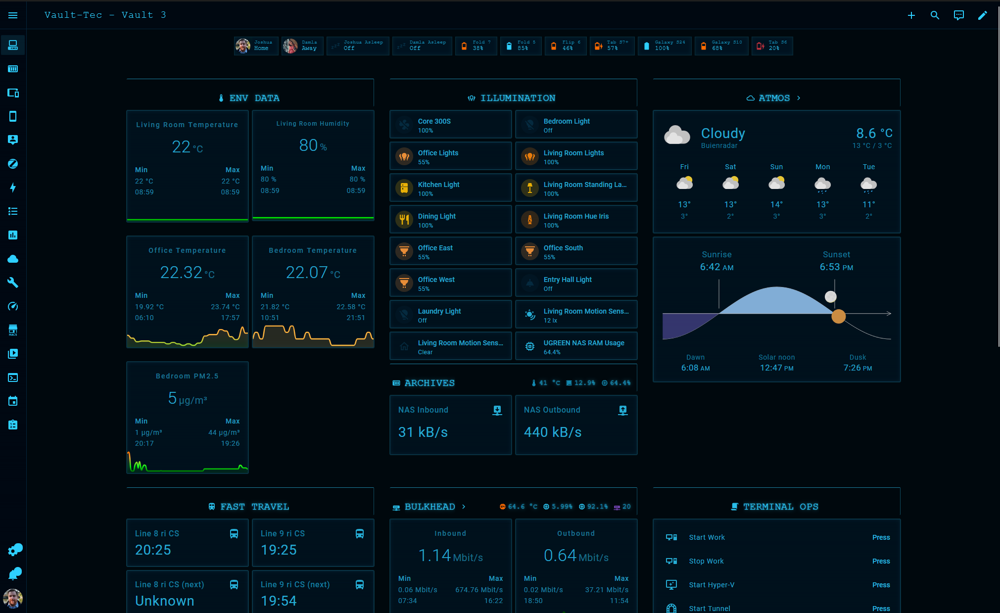
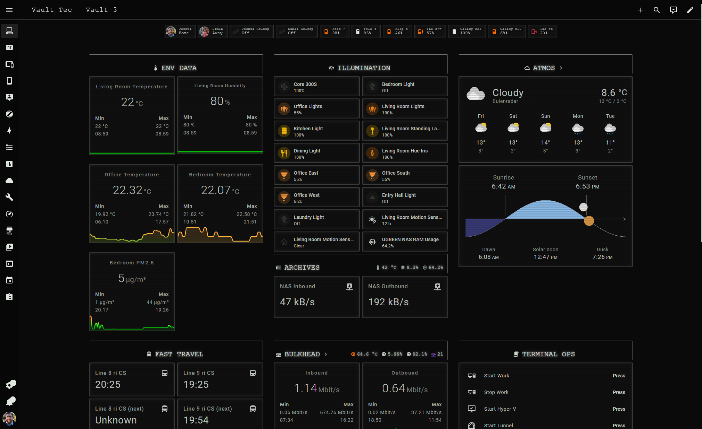
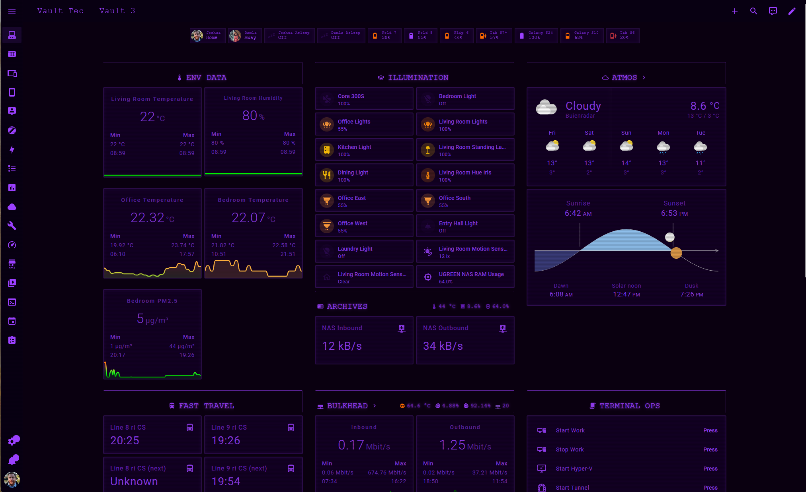

# Pip-Boy Terminal Theme for Home Assistant

A Fallout Pip-Boy / Vault-Tec terminal aesthetic theme for Home Assistant.
Derived from [Nezz's visionOS theme](https://github.com/Nezz/homeassistant-visionos-theme),
rebuilt as a post-apocalyptic CRT phosphor terminal.

Five variants are included:

**Pip-Boy** -- Fallout 3/4 phosphor green on near-black `#0C0C0C`

**Pip-Boy Amber** -- Fallout New Vegas burnt orange-gold on warm near-black `#0D0800`

**Pip-Boy Blue** -- Teal/cyan phosphor on deep blue-black `#00080D`

**Pip-Boy White** -- Cool white P4 phosphor on near-black `#0A0A0A`

**Pip-Boy Purple** -- Atomic purple on deep purple-black `#0A0010`

### Pip-Boy (Green)


### Pip-Boy Amber


### Pip-Boy Blue


### Pip-Boy White


### Pip-Boy Purple


## Features

- Five phosphor color variants: green, amber, purple, blue, white
- Scanline overlay on all cards simulating CRT display lines
- Vignette effect darkening screen edges like a real CRT
- Subtle phosphor flicker animation on the full interface
- Partial border chrome on section headers (top + right only) matching Pip-Boy UI panels
- Phosphor glow text-shadow on section headers
- Square corners everywhere -- no rounded Apple-style cards
- Monospace terminal font (Share Tech Mono) applied globally
- Sidebar scanline treatment
- Semantic color thresholds: phosphor green = nominal, amber = caution,
  orange = warning, red = critical

## Requirements

- [card-mod](https://github.com/thomasloven/lovelace-card-mod) (install via HACS)

## Installation

1. Copy `themes/pipboy/pipboy.yaml` into your Home Assistant
   `config/themes/pipboy/` directory.

2. Add the following to your `configuration.yaml` if not already present
   (reboot required):
```yaml
frontend:
  themes: !include_dir_merge_named themes
```

3. Reload themes via **Settings > System > Restart menu > Quick reload**,
   or call the service:
```yaml
service: frontend.reload_themes
```

4. Select **Pip-Boy**, **Pip-Boy Amber**, **Pip-Boy Purple**, **Pip-Boy Blue**, or **Pip-Boy White** from your profile theme dropdown.

## Font

The theme uses [Share Tech Mono](https://fonts.google.com/specimen/Share+Tech+Mono)
loaded via Google Fonts. An internet connection is required on first load for the
font to render correctly. If running a fully local HA setup, host the font locally
and update the `@import` URL in `card-mod-root`.


## Section Headers

The theme automatically applies Pip-Boy partial border chrome (top + right borders)
and phosphor glow to all `type: heading` cards. To match the font, sizing, and
alignment shown in the screenshots, add the following `card_mod` block to each
heading card:

```yaml
type: heading
heading: ENV DATA
heading_style: title
icon: mdi:thermometer
card_mod:
  style: |
    :host {
      font-family: "Share Tech Mono", "Courier New", monospace !important;
      letter-spacing: 0.1em !important;
      text-transform: uppercase !important;
      text-align: center !important;
      font-size: 1.5em !important;
    }
    * {
      font-family: "Share Tech Mono", "Courier New", monospace !important;
      text-align: center !important;
      font-size: inherit !important;
    }
    div, .heading-container {
      justify-content: center !important;
      display: flex !important;
      flex-direction: row !important;
      align-items: center !important;
      gap: 8px !important;
    }
```

Headers with entity badges (status pips) require the same `card_mod` block.
The badge styling is handled at the card level -- add your entities to the
`badges:` list as normal.

## Remarks

Derived from [Nezz's visionOS & Liquid Glass Theme](https://github.com/Nezz/homeassistant-visionos-theme)

Originally based on [Bas Nijholt's iOS Themes](https://github.com/basnijholt/lovelace-ios-themes)

Dropdown fixes from [Wessam Lauf's Frosted Glass Theme](https://github.com/wessamlauf/homeassistant-frosted-glass-themes)